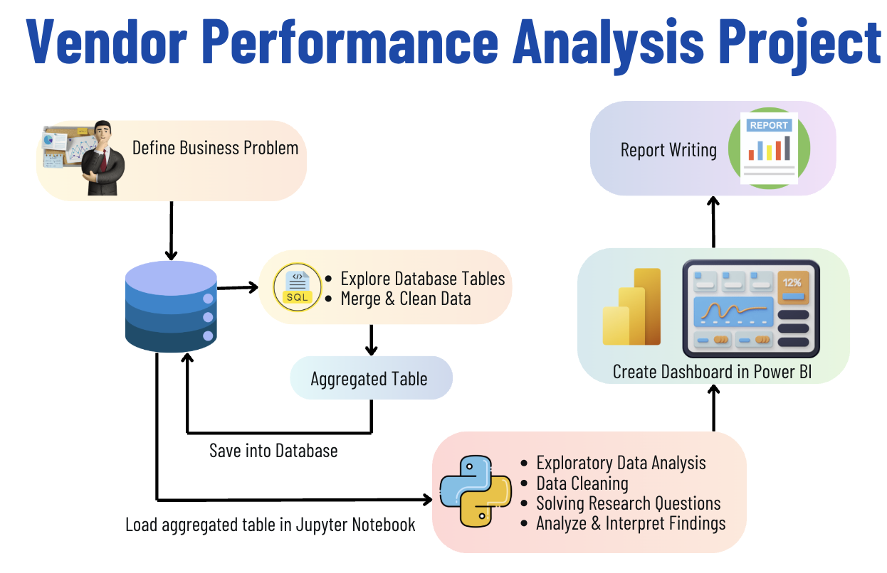

# End to End Vendor Analysis

## What This Project Does

This project digs into vendor performance for a wholesale/retail business. The goal: find out which brands and vendors are helping or hurting the bottom line, spot pricing issues, and figure out where inventory is getting stuck. Everything here is built to answer real business questions, not just play with data.

## Why It Matters

If you run a business, you want to know which vendors are making you money and which ones are dragging you down. This analysis shows you:
- Who your top and bottom vendors are
- Where you’re losing money on pricing or slow inventory
- How bulk buying affects your costs
- What you can do to boost profit and cut losses

## How It Works

- **Data Ingestion:** Loads big CSVs into a SQLite database using Python. Handles large files, logs every step.
- **Data Cleaning & Analysis:** Uses SQL and Pandas to clean, join, and analyze the data. All the heavy lifting happens here.
- **Visualization:** Power BI dashboard turns the numbers into something you can actually use.

## The Workflow



1. Define the business problem
2. Ingest CSVs into a database (Python, SQLite)
3. Clean and join data (SQL, Pandas)
4. Analyze and answer business questions (Jupyter)
5. Build a dashboard (Power BI)
6. Write up the findings

## What’s in the Data?

You’ll find real-world-style CSVs in `/data`:
- begin_inventory.csv
- end_inventory.csv
- purchases.csv
- purchase_prices.csv
- sales.csv
- vendor_invoice.csv

All of these get loaded into a single SQLite database for analysis.

## Key Files

- `Ingestion.ipynb` — Loads and logs all data into SQLite
- `Exploratory Data Analysis.ipynb` — Cleans, explores, and answers the big questions
- `inventory.db` — The database with everything in one place
- `Workflow.png` — The project at a glance
- `logs/` — Keeps track of what happened during ingestion
- `data/` — All the raw CSVs

## Skills on Display

- Real SQL for joins and aggregations
- Python scripting (with logging, chunking, and error handling)
- Data cleaning and EDA in Pandas
- Building a dashboard in Power BI
- Translating business problems into data solutions

## Folder Structure

```
End-to-End-Vendor-Insights-1/
│
├── data/                  # Raw CSV data files
│   ├── begin_inventory.csv
│   ├── end_inventory.csv
│   ├── purchases.csv
│   ├── purchase_prices.csv
│   ├── sales.csv
│   └── vendor_invoice.csv
│
├── logs/                  # Log files from ingestion and processing
│   └── log
│
├── .vscode/               # VSCode project settings
│   └── settings.json
│
├── .ipynb_checkpoints/    # Jupyter notebook checkpoints
│   └── analysis-checkpoint.ipynb
│
├── Exploratory Data Analysis.ipynb  # EDA and business insights
├── Ingestion.ipynb                 # Data ingestion notebook
├── inventory.db                    # SQLite database
├── Workflow.png                    # Project workflow diagram
├── README.md                       # Project documentation
└── .gitignore                      # Git ignore rules
```

## The Bottom Line

This isn’t a toy project. It’s built to show you can handle real data, answer real questions, and deliver insights that matter. If you want to see how I work with data from start to finish, this is it.

