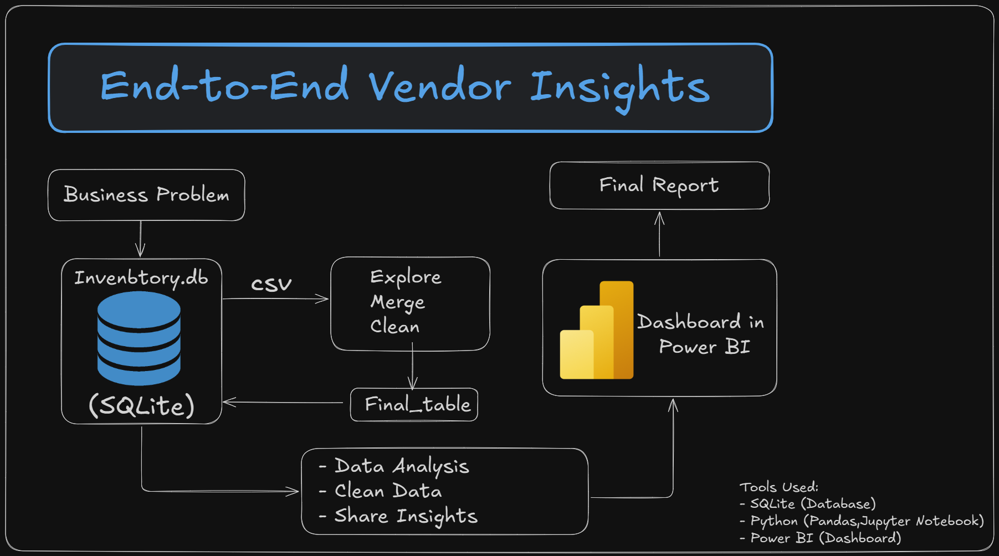

# End to End Vendor Analysis

## Overview

This project analyzes vendor performance in the wholesale and retail space. I used SQL, Python (Pandas), and Power BI to handle the full workflow — from cleaning raw data to generating business insights — the way it's done in actual industry settings.
---

## Business Problem

Inefficient vendor performance leads to losses from poor pricing, low inventory turnover, and vendor dependency. The goal of this project is to:

- Identify underperforming brands needing pricing/promotional adjustments
- Determine top-performing vendors contributing to sales and profit
- Analyze the impact of bulk purchasing on unit cost
- Assess inventory turnover to reduce holding cost
- Compare profitability between high- and low-performing vendors

---

## Tech Stack

- **SQL**: Data exploration, cleaning, aggregation
- **Python (Pandas, SQLAlchemy)**: Data ingestion, EDA, scripting, logging
- **Power BI**: Dashboard creation, visualization
- **Jupyter Notebook**: Exploratory analysis and research questions
- **SQLite**: Local relational database used for ease of testing and prototyping

---

## Project Workflow



1. **Define Business Problem**
2. **Ingest CSVs to Database**  
   - Use Python to read multiple CSVs and insert into SQLite
   - Write a data ingestion script with logging
3. **Explore & Clean Data in SQL**
   - Explore tables
   - Merge necessary fields
   - Create aggregated table for further analysis
4. **Save Aggregated Table**
   - Store cleaned and joined data back into database
5. **Load Aggregated Table into Jupyter Notebook**
   - Use Python (Pandas) for EDA
   - Solve business questions:
     - Profitability by vendor
     - Bulk discount patterns
     - Inventory turnover
6. **Create Power BI Dashboard**
   - Visualize only meaningful insights
   - Tailored to the business questions
7. **Write Final Report**
   - Structured summary of findings
   - Insight-driven storytelling for stakeholders

---

## Data Sources

Simulated wholesale industry data stored across multiple CSVs (in the `data/` folder):

- `begin_inventory.csv`
- `end_inventory.csv`
- `purchases.csv`
- `purchase_prices.csv`
- `sales.csv`
- `vendor_invoice.csv`

These were inserted into a SQLite database and used to simulate a real ETL pipeline.

---

## Scripts & Notebooks

- **Ingestion.ipynb**: Jupyter notebook for ingesting CSVs into SQLite with logging and chunked loading for large files.
- **Exploratory Data Analysis.ipynb**: Jupyter notebook for data cleaning, feature engineering, and answering research questions.
- **inventory.db**: SQLite database containing all ingested and processed data tables.
- **logs/**: Directory for log files generated during ingestion and processing.
- **data/**: Contains all raw CSV data files.
- **Workflow.png**: Visual diagram of the project workflow.

---

## Key Skills Demonstrated

- End-to-end project structuring
- SQL for complex data joins and aggregations
- Python scripting with logging and functions
- Power BI dashboarding
- Business problem solving with data
- Report writing with real, actionable insights

---

## Final Notes

- This project shows how to integrate multiple tools into one pipeline.
- It's designed to be **portfolio-worthy** and align with what hiring managers expect.
- All analysis and insights are tied directly to the defined business problem.

---

## Folder Structure

```
End-to-End-Vendor-Insights-1/
│
├── data/                  # Raw CSV data files
│   ├── begin_inventory.csv
│   ├── end_inventory.csv
│   ├── purchases.csv
│   ├── purchase_prices.csv
│   ├── sales.csv
│   └── vendor_invoice.csv
│
├── logs/                  # Log files from ingestion and processing
│   └── log
│
├── .vscode/               # VSCode project settings
│   └── settings.json
│
├── .ipynb_checkpoints/    # Jupyter notebook checkpoints
│   └── analysis-checkpoint.ipynb
│
├── Exploratory Data Analysis.ipynb  # EDA and business insights
├── Ingestion.ipynb                 # Data ingestion notebook
├── inventory.db                    # SQLite database
├── Workflow.png                    # Project workflow diagram
├── README.md                       # Project documentation
└── .gitignore                      # Git ignore rules
```

